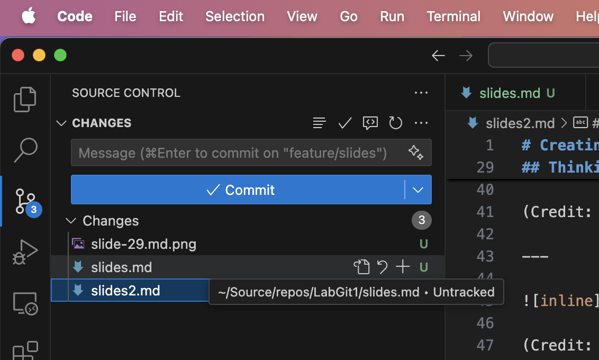
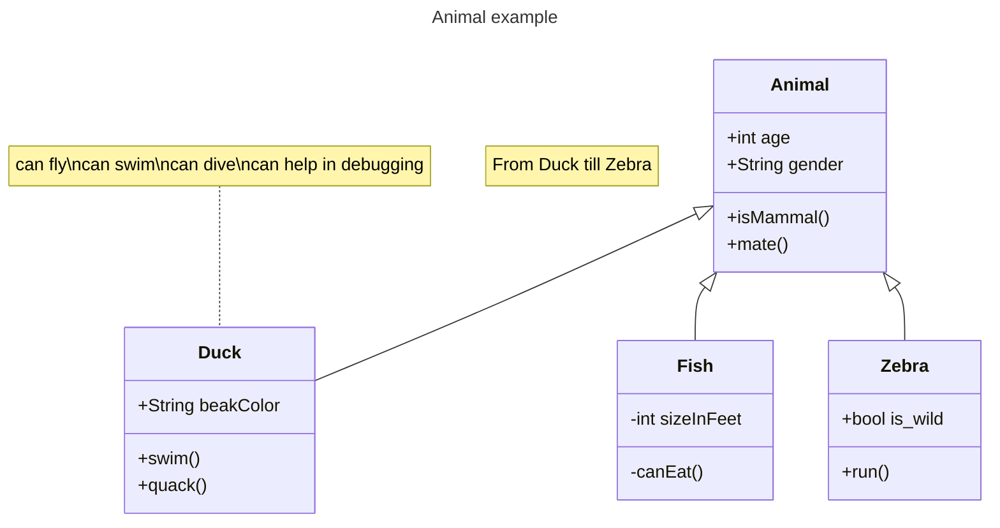
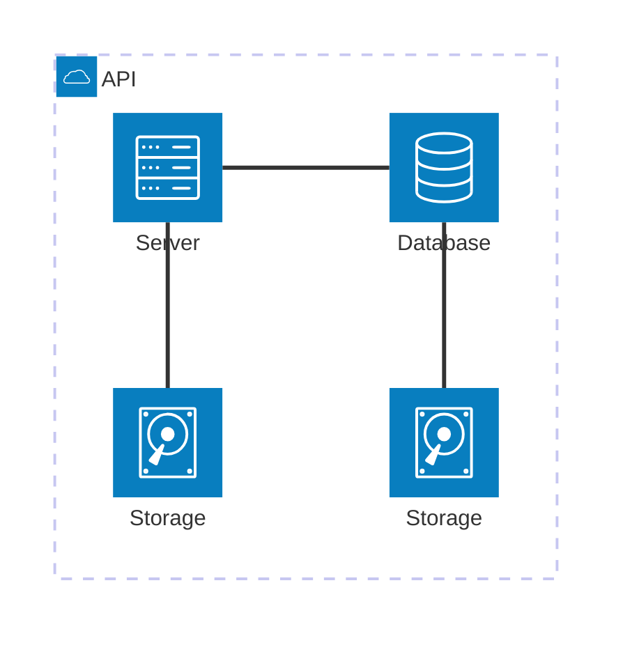

% Habits
% Alberto Murcia
% March 22, 2005

# Headline indicates a first level title.

## Subheader a second level title.



---

# Use Headings

Combine headings with paragraph text and other elements like lists:

- It's super quick.
- It's super easy.

---

# Paragraphs

Use a blank line in between text to start a new paragraph.

You can include a paragraph break by leaving an empty line between the paragraphs.
Otherwise lines will follow on directly like this.

---

# Code

También es posible utilizar código

```
using Microsoft.Extensions.Configuration;

namespace SomeNamespace 
{
    public class SomeClass
    {
        private IConfiguration _configuration;
    
        public SomeClass(IConfiguration configuration)
        {
            _configuration = configuration;
        }
    
        public SomeMethod()
        {
            // retrieve nested App Service app setting
            var myHierarchicalConfig = _configuration["My:Hierarchical:Config:Data"];
            // retrieve App Service connection string
            var myConnString = _configuration.GetConnectionString("MyDbConnection");
        }
    }
}
```

---

# Mermaid

Veamos también un diagrama:



---

# Mermaid 2

Diagramas de arquitectura



